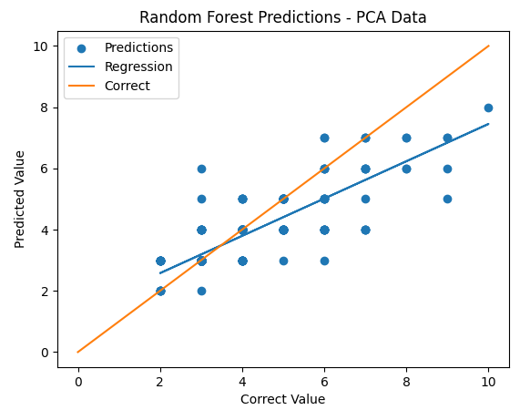

<h1 class="report-header">Final CS 4641 Report</h1>

	<iframe width="800" height="510" src="https://gtvault.sharepoint.com/sites/CS4641MLTeam/_layouts/15/stream.aspx?id=%2Fsites%2FCS4641MLTeam%2FShared%20Documents%2FGeneral%2FfinalCORRECTpresentation%2Emp4&referrer=Teams%2ETEAMS%2DWEB&referrerScenario=teamsSdk%2DopenFilePreview">
	</iframe>

## **_Introduction and Problem Definition_**

The objective of this project is to predict the sales price of a house based on a collection of features relating to the physical properties of the house. Traditionally, houses have been appraised on factors such as location, size, and materials [1]. Since estimating the value of a house is currently a mostly manual process that can only be done by a licensed appraiser, there is no guarantee that the house will get valued at what it is worth due to differences between appraisers. In addition, “home prices are up more than 30% over the past couple of years” [2]. A machine learning algorithm could quickly determine what a house should be valued with high accuracy. Current machine learning models tend to use only a few features like “historical data, unit size, and existing demand” but many more features, like “expected noise level, recreation options, and neighborhood rating” could be utilized for a more accurate estimation [4]. Home appraisals can cost between $600-$2000, which can be an expensive venture for many homeowners [3]. A machine learning model could provide lower income homeowners with a cheap and fast way to get their home appraised. We hope to increase the accuracy and accessibility of home appraisals.

## **_Data Collection and Cleaning_**

All data for this project was used from the house-prices-advanced-regression-techniques competition on Kaggle. 

Data cleaning was minimal. Each NA was replaced with 0. There are more sophisticated methods for replacing NAs such as using regression with other features, but since there were not many NAs this was deemed unecccesary. Many of the features had text rather than numerical data. For example, the "alley" feature was either "gravel" or "paved", the "land slope" feature was either "gentle", "moderate", or "severe. For these columns with text each unique word was replaced with a number (0,1,2...). So "alley" became 0 or 1 and "land slope" became 0, 1, or 2. Next, the data was normalized so that all features had values of a similar scale. The data was scaled to have a mean of 0 and standard deviation of 1. There was also experimentation with scaling all data from 0 to 1 such that the minimum value of each column was made 0, the maximum was made 1, and all other data points fell within 0 and 1.

A graph showing the distribution of house prices (shown below) given with our dataset was created to understand where the accuracy of our model would be most impactful.

    

Based on this graph our model will be most useful for houses within the range of $100000 to $300000.

A heatmap (shown below) was also generated for the entire dataset to visualize the entire dataset and the relationships between all the individual features.

    

Finally, sale prices were given along with years but the data set did not specify whether the values were adjusted for inflation. So, the sale prices were plotted as a function of year. There was no correlation between year and sale price meaning that it is likely that the values are adjusted for inflation.

## **_Methods_**

This project can be divided into 2 parts; data preprocessing and supervised learning methods. The first part of the project, data preprocessing, is simple and was entirely composed of dimensionality reduction. Multiple methods of reduction were used, those methods being PCA and backwards selection.

The second part was based around seeing how well different supervised learning methods could do with our dataset. The methods we developed models for were a Neural Network, Random Forest, and Gaussian Naive Bayes. After training all the models, we calculated some metrics on their perfofmance in order to analyze not only how well each model depicted the housing price samples, but also how the models compared to eachother in order to choose the model that worked best for our data.

## **_Results and Discussion - Goals_**

We would like to make a model that can accurately predict the final selling price of a home based on provided features of each home. To test this, we will utilize accuracy score and average precision metrics to determine the quality with which our models evaluate the testing dataset. The performance of the model should be comparable to that of licensed appraiser in order to be preferable to said appraiser. This would mean that the model would need to appraise houses within 2-3% of other appraisals [5] and would need to produce low appraisals less than 8% of the time [6]. We should expect that the number of features is not quite necessary and that PCA reveals the features that have the highest impact on the price.

## **_Results and Discussion - Feature Reduction_**

#### _PCA_

Feature/dimensionality reduction is an important aspect in the creation of a machine learning model for any data set. Feature reduction processes reduce the number of features in the data set that will be used by removing the least informative features. This not only ensures that we remove noise that may affect the performance of the ML models used, but also makes it so that model training is a less resource and time intensive process. 

The first feature reduction method implemented was PCA, which reduces dimensionality by finding the orthonormal basis for the provided data, sorting the dimensions in order of explained variance, and either discarding a set number of the least informative features or discarding the most features possible while maintaing a certain amount of the original variance in the data. This allows us to get concise low-dimensional representations of the original data, albeit while loosing feature labels due to the creation of new representative "features". Shown below is a heatmap of the features created after running PCA on the data with 40 new features being generated. The fact that the heatmap is diagonal indicates that the PCA reduction was succesful, as all the features generated are independent of one another.

    

PCA was used to generate 6 sets of dimensionally reduced data; three that maintain 40, 50, and 60 features, and another three that maintain 90%, 95%, 99% variance.

#### _Backwards Selection_

The second feature reduction method implemented was Backwards Selection. The particular implementation used for this project reduces dimensionality by initially taking the full data set and using a logistic regression to fit data and test the accuracy of the model, removing the single feature that reduces the accuracy the least (analyzed via significance testing of each feature) at each iteration until the number of desired remaining features is achieved. The main benefit to utilizing Backward Selection versus using PCA is that the labels of the features are maintained, as the data returned consists of already existing features rather than newly created characterizing features, which allows for greater understanding of what features are the most important when it comes to the modeling of and variance in the data being used. Three data sets were generated via Backward Selection, with each one containing the 20, 40, and 60 most statistically important features respectively. 

Each reduced data set must be run on each model selected in order to analyze the effects of dimenssionality reduction with each different method on the accuracy of said models. One idea that will be implemented in the near future is the creation of dimensionally reduced data from a data set that lacks all categorical features, so as to analyze whether or not the categorical features have any significant effect on model accuracy.

## **_Results and Discussion - Neural Network_**

A few neural networks were created to predict output prices. Each used Keras, a library that runs on top of TensorFlow. The first network that worked well had a fairly simple architecture: an input layer of 8 features, a hidden layer of 128 nodes, a hidden layer of 64 nodes, another hidden layer of 64 nodes, and then a single output node. The network is shown below.

    

First, input features were selected by hand that included only the numerical values that logically correlated with house prices. The input features were chosen to be LotFrontage, LotArea, TotalBsmtSF, 1stFlrSF, 2ndFlrSF, TotRmsAbvGrd, and GarageArea. The activation function for each layer was chosen to be relu because it is popular and tends to work well. Data was split into 70% training, 15% validation, and 15% testing. The network was trained on a collection of sale prices that were normalized to have a mean of 0 and standard devation of 1. So, the output of the neural network should also output values with a mean of 0 and standard deviation of one assuming the tested data follows roughly the same distribution as the training data. This means that the output of hte neural network is multiplied by the standard deviation of the data and added to the mean to obtain a continuous prediction. One consequence of scaling this data this way is the neural network sometimes outputs a negative prediction. An alternative to a continuous output would be to output a predicted interval by using one hot encoding. However, the occasional negative value is acceptable especially because it is obviously wrong and can be discarded.

    

The loss plot for training is shown above. For this neural network, the training loss is 0.379, the validation loss is 0.498, and the testing loss is 0.452. The selected loss function is mean absolute error and on the loss values are run on the data before it is scaled. The predicted value of the home vs. the correct value of the home is plotted below. The line has a slope of 1 meaning that a perfect network would only output values along that line. This network is not perfect so the data does not fall on the line. However, it does have a strong correlation to the actual data. For the displayed plot, the accuracy of the network is 63.74% on testing data where a correct prediction was defined to be within $50,000 of the correct value. The average error was $46,883.9 on the testing data.

    

Up until now, the neural network only considered the numerical features which were somewhat arbitrarily picked. The following neural networks include the string features. And the features are selected more methodically using PCA and backwards selection. Additionally, the architecture network was restructured by adding layers and trainable features because the original network was not producing sufficient results on the newly processed data. The new network used on the PCA and backwards selection has an input layer of 61 features, a hidden layer of 256 nodes, a hidden layer of 64 nodes, a hidden layer of 128 nodes, a hidden layer of 12 nodes, and then a single output node. This new architecture was found by guessing and checking different numbers of features. So there are certainly better architectures but this one worked well. The improved network is shown below.

    

The following plot is the result of PCA which reduced the data to 60 features. Here, the testing accuracy was 62.56%, the training loss 0.45, the validation loss 0.55, and the average testing error $47,045.7. Somewhat interestingly, PCA performed worse than the selection of features by hand. This is likely due to less useful features obscuring the more important features.

    

By far, the best neural network predictions came from the backward selection which reduced the data to 60 features. This is plotted below. The testing accuracy was 85.39%, training loss was 0.27, the validation loss was 0.52, and the average error on the testing was $32,832.2. It likely worked so well because backward selection filtered out the less useful features.

    

## **_Results and Discussion - Random Forest_**

A random forest was also used to predict the output prices, but now the data was altered to be more categorical/ discrete. To achieve this, the sales prices of the houses were divided into categories of $50,000. In this case, category 1 consisted of prices from $0 to $49,999, category 2 consisted of prices from $50,000 to $99,999, and so on (with the category number being the upper bound).  Once categories were defined (named SalePricev2 inside csv files), the training data was broken down into 80% testing data and 20% training data. In addition, different features were chosen based on the different selection processes that were implemented. The output for the random forest consisted of an integer denoting the category of prices that the house would fall in. 

The first selection process implemented was backward selection. This selection reduced the number of features to 20 features and produced the following output:

    

The output shown depicts the relationship between the correct category and the predicted category. The orange line consists of the relationship where the predicted category matches the original category. The blue line represents the best fit line for predicted categories. This output had the following metrics:

- Accuracy: 0.6164
- Precision: 0.6861
- Recall: 0.6164
- Root Mean Squared Error: 0.9009

The second selection process implemented was PCA with a variance of 95%. This selection reduced the number of features to 61 features and produced the following output:

    

The output shown depicts the relationship between the correct category and the predicted category. The orange line consists of the relationship where the predicted category matches the original category. The blue line represents the best fit line for predicted categories. This output had the following metrics:

- Accuracy: 0.6747
- Precission: 0.7430
- Recall: 0.6747
- Root Mean Squared Error: 0.8501

The third selection process implemented was a basic trim. This selection method consisted of a manual selection of certain features, reduced the number of features to 54 features, and produced the following output:

    

The output shown depicts the relationship between the correct category and the predicted category. The orange line consists of the relationship where the predicted category matches the original category. The blue line represents the best fit line for predicted categories. This output had the following metrics:

- Accuracy: 0.6438
- Precision: 0.6941
- Recall: 0.6438
- Root Mean Squared Error: 0.8235

Overall, for every selection method, the random forest algorithm had great success in predicting the first number of categories (up to around 5-6). After that, the algorithm began deteriorating in its predictions and produced outputs that were lower than the correct values. On average, the error on the predictions was roughly 1 category (so $50,000). These occurrences are most likely since there is very little training data for the higher end of the price categories. For example, there are roughly 100 houses spread across 9 of the 15 categories. Such a low amount of training data for the higher end of prices resulted in the algorithm predicting lower prices (as it had more training with those prices). 

## **_Results and Discussion - Gaussian Naive Bayes_**

Due to the fact that the distribution of samples for housing prices had a resembelance to a probability density function as shown in the Data Collection and Cleaning portion, it was decided that utilizing a Gaussian Naive Bayes model might produce good predictions on housing prices. This model was implemented by using Scikit Learn's GaussianNB library which, after instantiating a model,will simply take in the x and y data (the samples and their corresponding true labels) and fit the model to said data. The data used for the Gaussian Naive Bayes model was that which underwent feature reduction via Backward Selection. At any one instance of the model, 70% of the data was used for training and 30% was reserved for testing after running the fit method for GaussianNB. To see if features that had strings as values had any effect on the model, two models were created at once; one that used a data set that had all features when performing backwards selection and another that used a data set that only had non-string features prior to undergoing backward selection. In order to get more stable results, the average metrics of 30 different GaussianNB models were used for both the data with all features and the data with only non-string features, with each model having randomly selected samples that were to be used in testing and the remaining samples being saved for testing. After running code to implement the above methods, the metrics gained were as follows:

- Average Accuracy of Gaussian Naive_Bayes after 30 Iterations: 

	- Full Data Set : 80.29% 
	
	- No String Features : 80.53%
	
- Average RMSE of Gaussian Naive Bayes after 30 Iterations: 

	- Full Data Set : $58,644.48 
	
	- No String Features : $54,608.32
	
- Number of Classes in Final Models Generated:

	- Backwards Selection w/ Strings: 540
	
	- Backwards Selection w/o Strings: 530
	
Additionally, histograms of the true and predicted labels for the final iteration of both model versions were created in order to see if the general shape of the distribution seen earlier for the entire data set was maintained during testing. The histograms produced can be seen below:

     
     

The histograms indicate that the created models do not maintain the shape of either the distribution of the true test labels or the overall general shape of the entire sample set distribution shown previously in Data Collection and Cleaning. The metrics obtained indicate that removing the string features from the data set prior to backward selection increases the accuracy of this model by .24% and decreased RMSE (Root Mean Squared Error) by $4036.16. Due to how small these differences are, and the fact that these metrics can depend heavily on which data samples are used for training and which are used for testing, it can be reasonably assumed that the removal of string features from the data set prior to backward selection had little to no effect on the accuracy of the model. It should also be noted that the approach taken for calculating accuracy for this model was the same as the one used for the Neural Network, in that an accurate prediction was defined as being within $50,000 dollars of the actual house value for any given sample.

## **_Discussion - Comparing All Models_**

Overall the models discussed above all performed at an acceptable level reaching accuracies over 50% with each model. However, it is clear that the neural network performed much better than the others. Some possible reasons for the performance of each model are discussed below.

#### _Why the Neural Network Works Well_

Neural networks are generally very powerful, so it is not too surprising it performed better than the other models. They are well suited to this type of data set which incorporates many features that correlate with the cost of the house.  There are many patterns in this data that the neural network identified to give high accuracy. Additionally, the neural network is capable of outputting a continuous prediction (rather than discrete values) which is useful. Despite how well it worked, there is still some room for improvement. Neural networks generally need a lot of data, but this dataset only had ~1500 data points. And the architecture could be optimized through sweeps or the intuition of a more experienced programmer. So, a neural network with more training data and a better architecture could likely exceed 95% accuracy.

#### _Why the Random Forest Doesn't Work Well_

Random forest had the most inaccuracy in houses with higher value which heavily impacted the overall accuracy of the model. These inaccuracies likely come from the fact that the majority of training data is based around houses of values closer to $200k. Due to the large spread of housing prices in the data set that also leads to a large number of buckets for the data to be classified into which ultimately means a tree with a very large spread. There also may be a large amount of similarities between each of the buckets which makes it very difficult for the random tree to find ways of classifying the data. If this tree is trimmed in any way in the interest of preventing overfitting this could have major repercussions on the accuracy of the model. 

#### _Why Gaussian Naive Bayes Doesn't Works Well_

Gaussian Naive Bayes didn't work well in this scenario most likely due to the fact that, although we are dealing with a unimodal probability distribution, the distribution of the samples is skewed to the right. Gaussian Distributions, otherwise known as normal distributions, assume a bell curve shape, or symmetry around the mean of the distribution, which is not the case for our distribution of samples. The GaussianNB model attempts to make the samples fit inside a bell curve however, as can be seen from the histograms provided above. Though the predicted and true distributions share approximately the same mean, the predicted distribution has a more equal spread to the left and right of its mean than the true distribution does and is compressed closer to the mean so as to have less of a skew. This forced fit makes it so that predictions closer to the mean will be more likely to be exact and will have a smaller error to them than predictions that are far out from the mean.

## **_Conclusion_**

Overall, the three models developed performed well on our data set. Through process of elimination based on the accuracy of each model it was determined that using backwards selection for dimensionality reduction and then plugging the reduced data into a neural network was the best for our use case. Through this we were able to create a model that was capable of reaching 85.39% accuracy.

In the future it may be possible for us to explore even more ways to reduce or add more descriptive features which would then allow us to create an even more sophisticated model that is capable of predicting house prices at a higher accuracy than ±$50k. Another improvement that can be made is collecting more data across more regions of the world so the model can be trained on data that includes more than just houses in Ames, Iowa. With these improvements people around the world may be able to use this tool to aid them in the process of appraising and selling their houses.

## **_Proposed Timeline_**

[https://gtvault.sharepoint.com/:x:/s/CS4641MLTeam/EdH8sfsprf5Bpll49tOz1CEBrhzMm3WEoffaCXk48d5Lmg?e=ifMY1G](https://gtvault.sharepoint.com/:x:/s/CS4641MLTeam/EdH8sfsprf5Bpll49tOz1CEBrhzMm3WEoffaCXk48d5Lmg?e=ifMY1G)

## **_Contributions_**

German Ortega:	Formatted Presentation, potential results, Researched datasets and references, produced feature reduced data via PCA and Backward Selection, along with accompanying results and discussion section, produced data visualization via heatmap, created model, visuals, and wrote analysis for the Gaussian Naive Bayes Model.

Sergio Ruiz: Assisted with data visualization, wrote for potential results, researched datasets, found references

Cade Tyler: Data cleaning, coding, results, and discussion of neural network, wrote part of intro, made Gantt chart, made GitHub page

Gavin Goodler: Created presentation slides for backwards selection, model comparisons, and conclusions, wrote for methods, model comparisons, conclusions, and data visualization, added theme to page, created styling and formatting for page, found data set

Ivan Alkhovik:	Wrote for methods, potential results, and intro. Researched references. Added code for Random Forest and its output visualization. Added results, methods, and discussions for Random Forest and recorded audio for those.

## **_Dataset_**

[https://www.kaggle.com/competitions/house-prices-advanced-regression-techniques/data](https://www.kaggle.com/competitions/house-prices-advanced-regression-techniques/data)

## **_References_**

[1] D. M. Grether and P. Mieszkowski, “Determinants of real estate values,” Journal of Urban Economics, vol. 1, no. 2, pp. 127–145, 1974. 

[2] C. Arnold, R. Benincasa, J. GaNun, and H. Chu, “There's a massive housing shortage across the U.S. here's how bad it is Where you live,” NPR, 14-Jul-2022. [Online]. Available: [https://www.npr.org/2022/07/14/1109345201/theres-a-massive-housing-shortage-across-the-u-s-heres-how-bad-it-is-where-you-l](https://www.npr.org/2022/07/14/1109345201/theres-a-massive-housing-shortage-across-the-u-s-heres-how-bad-it-is-where-you-l). [Accessed: 21-Feb-2023]. 

[3] H. Kielar, “Home appraisal: Process and cost,” Home Appraisal: Process And Cost Rocket Mortgage. [Online]. Available: [https://www.rocketmortgage.com/learn/home-appraisal](https://www.rocketmortgage.com/learn/home-appraisal). [Accessed: 21-Feb-2023]. 

[4] “How machine learning is revolutionizing the real estate sector,” Ai superior, 21-Nov-2022. [Online]. Available: [https://aisuperior.com/blog/how-machine-learning-is-revolutionising-the-real-estate-sector/](https://aisuperior.com/blog/how-machine-learning-is-revolutionising-the-real-estate-sector/). [Accessed: 21-Feb-2023]. 

[5] R. Coleman, “How accurate are home appraisals?,” ExcelAppraise, 16-Mar-2021. [Online]. Available: [https://www.excelappraise.com/how-accurate-are-home-appraisals/#:~:text=There's%20an%20acceptable%20variance%20when,10%25%20difference%20may%20be%20acceptable](https://www.excelappraise.com/how-accurate-are-home-appraisals/#:~:text=There's%20an%20acceptable%20variance%20when,10%25%20difference%20may%20be%20acceptable). [Accessed: 24-Feb-2023]. 

[6] E. Chang, “How to avoid a low home appraisal,” Bankrate. [Online]. Available: [https://www.bankrate.com/mortgages/how-to-avoid-a-low-home-appraisal/#:~:text=Low%20home%20appraisals%20do%20not,the%20neighborhood%20and%20market%20conditions](https://www.bankrate.com/mortgages/how-to-avoid-a-low-home-appraisal/#:~:text=Low%20home%20appraisals%20do%20not,the%20neighborhood%20and%20market%20conditions). [Accessed: 24-Feb-2023]. 

